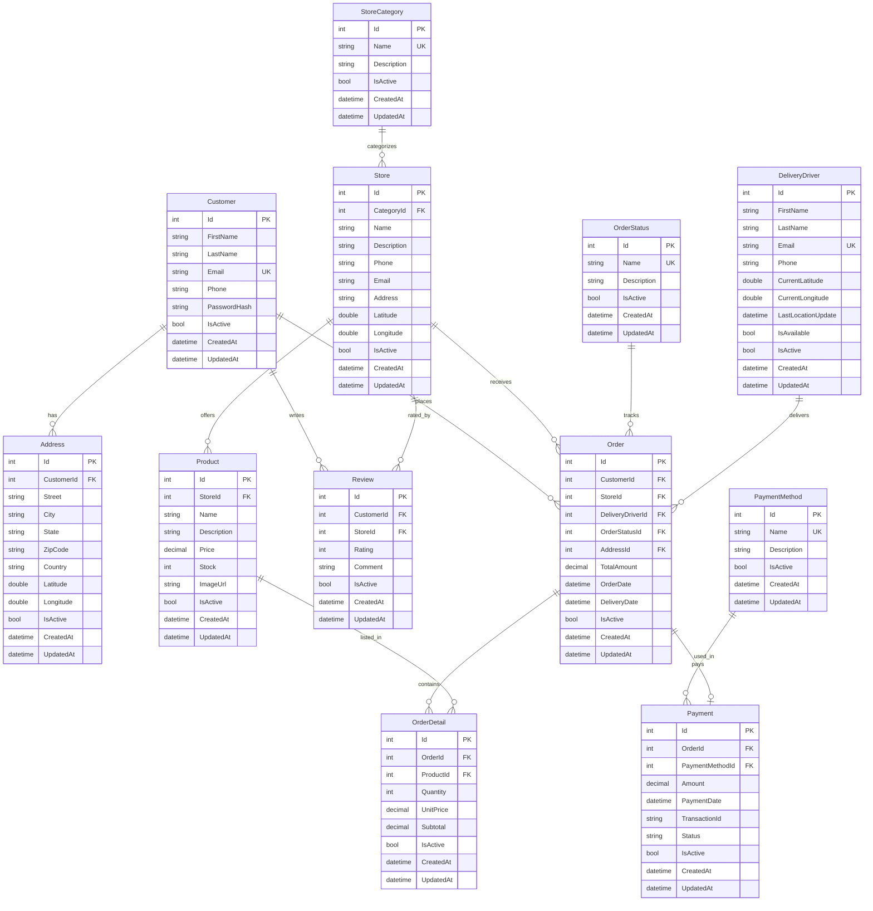

# Orbi

Multi-service delivery platform. Restaurants, pharmacies and supermarkets in one web app.

## Tech Stack

| Technology | Version |
|------------|---------|
| ASP.NET Core MVC | 10.0 |
| Entity Framework Core | 10.0 |
| C# | 13 |
| PostgreSQL | 16 |
| Bootstrap | 5.3 |
| Npgsql | 10.0.2 |

## Entity Relationship



## Installation

```bash
# clone
git clone git@github.com:jeffersonmejia/orbi-app.git
cd orbi-app

# database
docker compose up -d

# run
dotnet run --project src/Orbi.Web
```

Open `http://localhost:5130`.

## Documentation

| File | Description |
|------|-------------|
| [ARCHITECTURE.md](docs/ARCHITECTURE.md) | Layers, patterns, ERD, scalability |
| [API.md](docs/API.md) | Endpoints, request and response schemas |
| [SECURITY.md](docs/SECURITY.md) | Auth, data protection, reporting |
