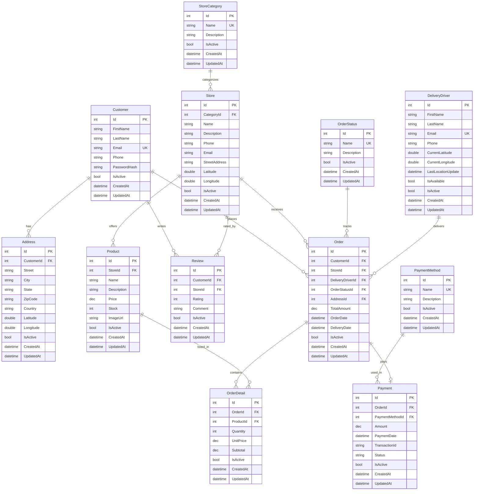

# Orbi

Multi-service delivery platform. Restaurants, pharmacies and supermarkets in one web app.

## Tech Stack

| Technology            | Version |
| --------------------- | ------- |
| ASP.NET Core MVC      | 10.0    |
| Entity Framework Core | 10.0    |
| C#                    | 13      |
| PostgreSQL            | 16      |
| Bootstrap             | 5.3     |
| Npgsql                | 10.0.2  |

## Entity Relationship



## Installation

```bash
# clone
git clone git@github.com:jeffersonmejia/orbi-app.git
cd orbi-app

# database
docker compose up -d

# run
dotnet run --project src/Orbi.Web
```

Open `http://localhost:5130`.

## Database

The application is prepared for large seed datasets and paginated screens.

Applied optimizations:

- Server-side pagination was applied with `Skip` and `Take`.
  This means the database returns only the current page instead of loading all records into memory. It keeps list screens stable when the database has hundreds of thousands of rows.

- Projection queries were applied in services.
  A projection selects only the fields needed by each view model. This reduces transferred data and avoids loading full entity graphs for list screens.

- `AsNoTracking` was applied to read-only list and detail queries.
  This tells EF Core not to track entities that will not be edited. It reduces memory usage and speeds up read-heavy pages.

- Composite indexes were added through the `OptimizeLargeDatasetQueries` migration.
  These indexes support common filters such as `IsActive`, foreign keys, ordering fields, and paginated list queries. They help PostgreSQL find records without scanning entire tables.

- PostgreSQL `pg_trgm` and GIN trigram indexes were added through the `AddTrigramSearchIndexes` migration.
  Trigram indexes optimize text searches used by `Contains`, such as searching names, emails, cities, and statuses.

- Large dropdown queries were limited with `Take(200)`.
  This avoids loading thousands of customers, products, stores, addresses, or orders into form select lists.

- In-memory cache was added for small reference dropdowns.
  Store categories, order statuses, and payment methods are cached because they change rarely and are reused often.

EF Core applies pending migrations when the web app starts. Stopping Docker does not remove migration files. Removing the Docker volume deletes the database data, but the migrations remain in code and can be applied again.

Materialized views are not required for the current CRUD screens. They should be added later only for dashboard-style reports or expensive aggregates.

## Documentation

| File                                    | Description                             |
| --------------------------------------- | --------------------------------------- |
| [ARCHITECTURE.md](docs/ARCHITECTURE.md) | Layers, patterns, ERD, scalability      |
| [API.md](docs/API.md)                   | Endpoints, request and response schemas |
| [ROLS.MD](docs/ROLS.MD)                 | Roles and permissions                   |
| [SEED.md](docs/SEED.md)                 | Large seed plan and execution order     |
| [SECURITY.md](SECURITY.md)              | Auth, data protection, reporting        |
