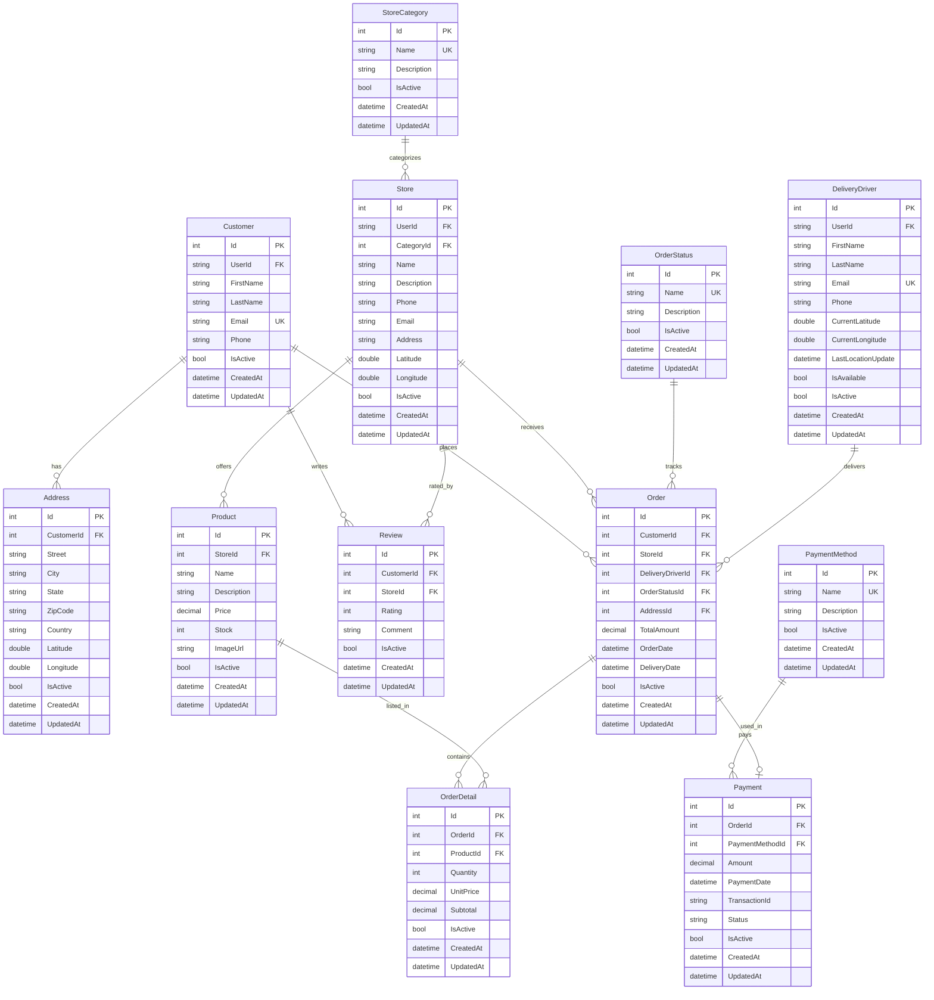
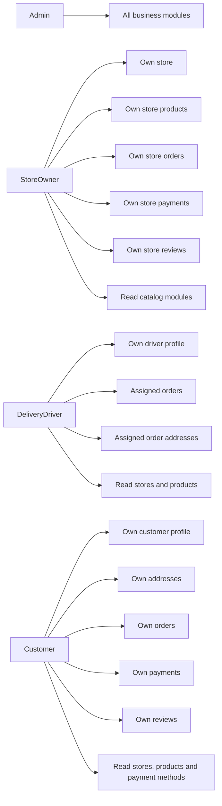

# Orbi

ASP.NET Core MVC delivery platform for restaurants, pharmacies, supermarkets, orders, payments, drivers and reviews.

## Stack

| Component | Use |
| --- | --- |
| ASP.NET Core MVC | Razor/MVC web application |
| Entity Framework Core | Data access and migrations |
| PostgreSQL | Database |
| ASP.NET Identity | Users, roles and sessions |
| Bootstrap | Base UI |

## Run

```bash
docker compose up -d
dotnet run --project src/Orbi.Web
```

Open `http://localhost:5130`.

The app applies pending migrations and seeds data on startup.

## Entity Relationship



## Role Access

Navigation stays visible for authenticated users. Forbidden sections return `403` and show the access denied page.



| Role | Main access |
| --- | --- |
| `Admin` | Full CRUD on business entities. |
| `StoreOwner` | Own store, products, orders, payments and reviews. |
| `DeliveryDriver` | Own profile and assigned orders. |
| `Customer` | Own profile, addresses, orders, payments and reviews. |

## Applied Security

- Global MVC role gate for business controllers.
- Service-level ownership filters through `UserId`.
- Server-side validation against guessed IDs.
- Forbidden service access converted to `403`.
- Login lockout after failed attempts.
- Public registration limited to `Customer`, `DeliveryDriver` and `StoreOwner`.
- `HttpOnly`, `SameSite=Strict` cookies, with secure cookies in production.
- Security headers: CSP, `X-Frame-Options`, `X-Content-Type-Options`, `Referrer-Policy` and `Permissions-Policy`.
- HSTS outside development and HTTPS redirection.
- Home chart cache avoids re-rendering when counts have not changed.

## Applied Optimizations

- Server-side pagination with `Skip` and `Take`.
- Compact pagination UI with first, previous, page selector, next and last controls.
- ViewModel projections in services.
- `AsNoTracking` on read queries.
- Composite indexes for common filters.
- Trigram GIN indexes for text search.
- Large dropdown queries capped at 200 records.
- In-memory cache for small reference catalogs.

## Pending Work

- Automated authorization tests for cross-user data access.
- Audit logs for sensitive writes.
- Dedicated cancellation and operational status-change flows.
- Email confirmation and password recovery.
- Production security policies for real domains and infrastructure.

## Documentation

| File | Description |
| --- | --- |
| `docs/API.md` | MVC routes and permissions |
| `docs/ROLS.MD` | Role matrix and ownership rules |
| `SECURITY.md` | Security policy and controls |
| `docs/SEED.md` | Initial data |
| `docs/ARCHITECTURE.md` | Architecture notes |
