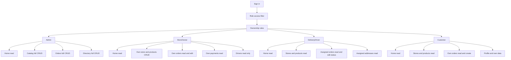

# Orbi

## 1. Summary

Orbi is an ASP.NET Core MVC delivery platform for restaurants, pharmacies and supermarkets. It manages catalog data, customers, addresses, stores, products, orders, delivery drivers, payments and reviews with ASP.NET Identity roles.

## 2. Technologies

| Technology | Exact version | Source |
| --- | --- | --- |
| .NET SDK | 10.0.300 | Local SDK |
| Target framework | net10.0 | `src/Orbi.Web/Orbi.Web.csproj` |
| ASP.NET Core MVC | 10.0 | Target framework |
| ASP.NET Identity EF Core | 10.0.2 | `Microsoft.AspNetCore.Identity.EntityFrameworkCore` |
| Entity Framework Core Design | 10.0.9 | `Microsoft.EntityFrameworkCore.Design` |
| Entity Framework Core Tools | 10.0.9 | `Microsoft.EntityFrameworkCore.Tools` |
| Npgsql EF Core provider | 10.0.2 | `Npgsql.EntityFrameworkCore.PostgreSQL` |
| Visual Studio Web Code Generation | 10.0.2 | `Microsoft.VisualStudio.Web.CodeGeneration.Design` |
| PostgreSQL Docker image | postgres:16-alpine | `docker-compose.yml` |
| Seed Docker image | postgres:16-alpine | `docker-compose.yml` |
| Docker Engine | 26.1.5+dfsg1 | Local Docker CLI |
| Docker Compose | 2.26.1-4 | Local Docker Compose plugin |
| Bootstrap | 5.3.3 | `wwwroot/lib/bootstrap` |
| Bootstrap Icons | 1.11.3 | CDN in `_Layout.cshtml` |
| jQuery | 3.7.1 | `wwwroot/lib/jquery` |
| jQuery Validation | 1.21.0 | `wwwroot/lib/jquery-validation` |
| jQuery Validation Unobtrusive | 4.0.0 | `wwwroot/lib/jquery-validation-unobtrusive` |

## 3. Installation

```bash
git clone git@github.com:jeffersonmejia/orbi-app.git
cd orbi-app
docker compose up -d
dotnet run --project src/Orbi.Web
```

Open `http://localhost:5130`.

The app applies pending EF Core migrations on startup. The seed container waits for the EF Core schema and then loads the SQL files in `db/`.

## 4. Role and Business Flow



This view is intended for non-technical readers. Every user signs in through the same application, the role access filter decides which pages are visible, and ownership rules limit the records each role can read or change.
