# API and MVC Routes

Orbi exposes MVC routes with the default pattern:

```text
/{Controller}/{Action}/{id?}
```

List screens accept `searchField`, `searchTerm` and `page`.

## Public

| Method | Route | Use |
| --- | --- | --- |
| GET | `/` | Home |
| GET | `/Home/Index` | Home |
| GET | `/Home/RecordCounts` | Home chart counts |
| GET | `/Home/DbStatus` | Database status |
| GET | `/Account/Login` | Login form |
| POST | `/Account/Login` | Sign in |
| GET | `/Account/Register` | Registration form |
| POST | `/Account/Register` | Create `Customer`, `DeliveryDriver` or `StoreOwner` user |

`POST /Account/Logout` requires an authenticated user.

## Role Access

```mermaid
flowchart TD
    Admin --> AllModules[All modules: CRUD]

    StoreOwner --> StoreOwned[Stores: own CRUD]
    StoreOwner --> ProductOwned[Products: own store CRUD]
    StoreOwner --> OrderOwned[Orders: own store read/edit]
    StoreOwner --> PaymentOwned[Payments: own store read]
    StoreOwner --> ReviewOwned[Reviews: own store read]
    StoreOwner --> StoreOwnerRead[Categories and payment methods: read]

    DeliveryDriver --> DriverProfile[Drivers: own read/edit]
    DeliveryDriver --> DriverOrders[Orders: assigned read/edit status]
    DeliveryDriver --> DriverCatalog[Stores and products: read]

    Customer --> CustomerProfile[Customers: own read/edit]
    Customer --> CustomerAddresses[Addresses: own CRUD]
    Customer --> CustomerOrders[Orders: own read/create]
    Customer --> CustomerPayments[Payments: own read/create]
    Customer --> CustomerReviews[Reviews: own CRUD]
    Customer --> CustomerCatalog[Stores, products and payment methods: read]
```



| Module | Admin | StoreOwner | DeliveryDriver | Customer |
| --- | --- | --- | --- | --- |
| StoreCategories | CRUD | Read | Read | Read |
| Stores | CRUD | Own CRUD | Read | Read |
| Products | CRUD | Own store CRUD | Read | Read |
| Customers | CRUD | Forbidden | Forbidden | Own read/edit |
| Addresses | CRUD | Forbidden | Assigned order address read | Own CRUD |
| Orders | CRUD | Own store read/edit | Assigned read/edit status | Own read/create |
| OrderStatuses | CRUD | Read | Read | Read |
| DeliveryDrivers | CRUD | Read | Own read/edit | Forbidden |
| PaymentMethods | CRUD | Read | Forbidden | Read |
| Payments | CRUD | Own store read | Forbidden | Own read/create |
| Reviews | CRUD | Own store read | Forbidden | Own CRUD |

Navigation remains visible. Forbidden access returns `403` and shows the access denied page.

## CRUD Routes

| Action | Method | Route |
| --- | --- | --- |
| Index | GET | `/{Controller}` |
| Details | GET | `/{Controller}/Details/{id}` |
| Create | GET/POST | `/{Controller}/Create` |
| Edit | GET/POST | `/{Controller}/Edit/{id}` |
| Delete | POST | `/{Controller}/Delete/{id}` |

`Delete` is a soft delete through `IsActive = false`.

## Ownership Rules

| Role | Rule |
| --- | --- |
| Customer | `Customers.UserId == User.Id` |
| StoreOwner | `Stores.UserId == User.Id` |
| DeliveryDriver | `DeliveryDrivers.UserId == User.Id` |

Sensitive queries are scoped by owner in services. Sensitive writes validate ownership again before saving.

## Input Security

- All POST actions use antiforgery tokens.
- Order totals are calculated server-side.
- Public registration cannot create `Admin`.
- Form dropdowns only load records within the signed-in user's scope.
