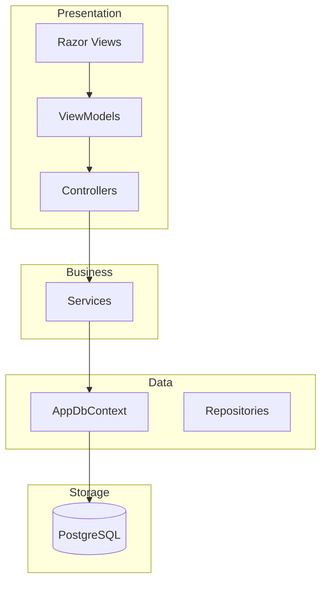

# Architecture

## Project Layers



## Entity Relationship

```mermaid
erDiagram
    Customer ||--o{ Address : has
    Customer ||--o{ Order : places
    Customer ||--o{ Review : writes
    StoreCategory ||--o{ Store : categorizes
    Store ||--o{ Product : offers
    Store ||--o{ Order : receives
    Store ||--o{ Review : rated_by
    Order ||--o{ OrderDetail : contains
    Product ||--o{ OrderDetail : listed_in
    OrderStatus ||--o{ Order : tracks
    DeliveryDriver ||--o{ Order : delivers
    PaymentMethod ||--o{ Payment : used_in
    Order ||--o| Payment : pays

    Customer {
        int Id PK
        string FirstName
        string LastName
        string Email UK
        string Phone
        string PasswordHash
        bool IsActive
        datetime CreatedAt
        datetime UpdatedAt
    }
    Address {
        int Id PK
        int CustomerId FK
        string Street
        string City
        string State
        string ZipCode
        string Country
        double Latitude
        double Longitude
        bool IsActive
    }
    StoreCategory {
        int Id PK
        string Name UK
        string Description
        bool IsActive
    }
    Store {
        int Id PK
        int CategoryId FK
        string Name
        string Description
        string Phone
        string Email
        string Address
        double Latitude
        double Longitude
        bool IsActive
    }
    Product {
        int Id PK
        int StoreId FK
        string Name
        string Description
        decimal Price
        int Stock
        string ImageUrl
        bool IsActive
    }
    Order {
        int Id PK
        int CustomerId FK
        int StoreId FK
        int DeliveryDriverId FK
        int OrderStatusId FK
        int AddressId FK
        decimal TotalAmount
        datetime OrderDate
        datetime DeliveryDate
        bool IsActive
    }
    OrderDetail {
        int Id PK
        int OrderId FK
        int ProductId FK
        int Quantity
        decimal UnitPrice
        decimal Subtotal
        bool IsActive
    }
    OrderStatus {
        int Id PK
        string Name UK
        string Description
        bool IsActive
    }
    DeliveryDriver {
        int Id PK
        string FirstName
        string LastName
        string Email UK
        string Phone
        double CurrentLatitude
        double CurrentLongitude
        datetime LastLocationUpdate
        bool IsAvailable
        bool IsActive
    }
    PaymentMethod {
        int Id PK
        string Name UK
        string Description
        bool IsActive
    }
    Payment {
        int Id PK
        int OrderId FK UK
        int PaymentMethodId FK
        decimal Amount
        datetime PaymentDate
        string TransactionId
        string Status
        bool IsActive
    }
    Review {
        int Id PK
        int CustomerId FK
        int StoreId FK
        int Rating
        string Comment
        bool IsActive
    }
```

## Scalability

| Concern | Implementation |
|---------|---------------|
| Pagination | Skip and Take with page and pageSize parameters |
| Filtering | IQueryable chain with server-side predicates |
| Soft Delete | IsActive flag with global query filters |
| Indexes | Composite indexes on StoreId plus Name, CustomerId plus StoreId, OrderDate |
| Eager Loading | Selective Include to prevent N plus 1 |
| Sessions | Distributed cache ready for Redis or SQL Server |

## Detalles

### Explicación de componentes

| Componente | Explicación |
| --- | --- |
| `Models` | Contiene las clases que representan las entidades principales del dominio de Orbi, como clientes, tiendas, productos, pedidos, pagos, reseñas, repartidores y catálogos. También incluye `BaseEntity`, que centraliza campos comunes como `Id`, `IsActive`, `CreatedAt` y `UpdatedAt` para aplicar eliminación lógica y auditoría básica. |
| `Data` | Define el acceso a datos mediante `AppDbContext`, que hereda de `IdentityDbContext<ApplicationUser>` para integrar las tablas del negocio con ASP.NET Identity. En esta capa se configuran `DbSet`, relaciones, índices, filtros globales por `IsActive`, extensión `pg_trgm` y actualización automática de fechas al guardar cambios. |
| `Controllers` | Recibe las solicitudes HTTP y coordina las acciones de cada módulo MVC. Los controladores gestionan rutas para listar, ver detalles, crear, editar y eliminar registros, además de delegar la lógica de acceso y consulta a los servicios correspondientes. |
| `Views` | Contiene las pantallas Razor que muestran formularios, tablas, detalles, navegación y mensajes al usuario. Las vistas consumen `ViewModels` para presentar información filtrada según el rol autenticado y el módulo al que se accede. |
| `Services` | Encapsula la lógica de negocio y las consultas sensibles del sistema. Esta capa aplica filtros por propietario, paginación, búsquedas con `IQueryable`, validaciones antes de escribir datos y restricciones específicas para `Admin`, `StoreOwner`, `DeliveryDriver` y `Customer`. |
| `ViewModels` | Define objetos diseñados para transportar datos entre controladores y vistas sin exponer directamente las entidades completas. Incluye modelos para formularios de login, registro, perfil, paginación, dashboard y operaciones de cada módulo del sistema. |
| `Migrations` | Registra los cambios estructurales de la base de datos generados por Entity Framework Core. Incluye la creación inicial del esquema, optimizaciones para consultas con grandes volúmenes de datos, índices de búsqueda y campos adicionales para usuarios de la aplicación. |
| `Program.cs` | Configura el arranque de la aplicación ASP.NET Core: MVC, filtros globales de autorización, conexión PostgreSQL, Identity, cookies, servicios del dominio, cabeceras de seguridad, rutas, migraciones automáticas y carga inicial mediante `DbSeeder`. |
| `appsettings.json` | Guarda la configuración base de la aplicación, incluyendo niveles de logging, hosts permitidos y la cadena de conexión `DefaultConnection` hacia PostgreSQL en `localhost:5432` con la base `OrbiDb`. |

### Modelo de datos

| Modelo | Descripción | Relaciones principales |
| --- | --- | --- |
| `ApplicationUser` | Usuario de autenticación administrado por ASP.NET Identity. Permite asociar credenciales y roles con perfiles de cliente, dueño de tienda o repartidor. | Se vincula con `Customer`, `Store` y `DeliveryDriver` mediante `UserId`. |
| `Customer` | Representa al cliente que compra en la plataforma. Guarda nombres, correo único, teléfono, estado activo y datos de auditoría. | Tiene muchas `Addresses`, muchas `Orders` y muchas `Reviews`; se asocia a un `ApplicationUser`. |
| `Address` | Almacena direcciones de entrega del cliente, incluyendo calle, ciudad, estado, código postal, país y coordenadas. | Pertenece a un `Customer` y puede ser usada por una `Order`. |
| `StoreCategory` | Catálogo de categorías para clasificar tiendas, por ejemplo restaurantes, farmacias o supermercados. | Tiene muchas `Stores`; su nombre es único. |
| `Store` | Representa el negocio que vende productos dentro de Orbi. Registra categoría, propietario, contacto, dirección, coordenadas y estado activo. | Pertenece a `StoreCategory` y a un `ApplicationUser`; tiene muchos `Products`, `Orders` y `Reviews`. |
| `Product` | Producto ofrecido por una tienda. Incluye nombre, descripción, precio, stock, imagen y estado activo. | Pertenece a una `Store` y aparece en muchos `OrderDetails`. |
| `Order` | Pedido realizado por un cliente a una tienda. Guarda cliente, tienda, dirección, estado, repartidor, total, fecha de pedido y fecha de entrega. | Pertenece a `Customer`, `Store`, `OrderStatus`, `Address` y opcionalmente a `DeliveryDriver`; tiene muchos `OrderDetails` y un `Payment`. |
| `OrderDetail` | Detalle de los productos incluidos en un pedido. Registra producto, cantidad, precio unitario y subtotal. | Pertenece a una `Order` y a un `Product`. |
| `OrderStatus` | Catálogo de estados para controlar el avance del pedido, como pendiente, en proceso, entregado o cancelado. | Tiene muchas `Orders`; su nombre es único. |
| `DeliveryDriver` | Perfil del repartidor encargado de entregar pedidos. Guarda datos personales, correo único, ubicación actual, disponibilidad y estado activo. | Se asocia a un `ApplicationUser` y puede tener muchas `Orders` asignadas. |
| `PaymentMethod` | Catálogo de métodos de pago disponibles en la plataforma. | Tiene muchos `Payments`; su nombre es único. |
| `Payment` | Pago asociado a un pedido. Registra método de pago, monto, fecha, transacción, estado y eliminación lógica. | Pertenece a una `Order` en relación uno a uno y a un `PaymentMethod`. |
| `Review` | Reseña realizada por un cliente sobre una tienda. Guarda calificación, comentario, estado activo y fechas de auditoría. | Pertenece a un `Customer` y a una `Store`. |
