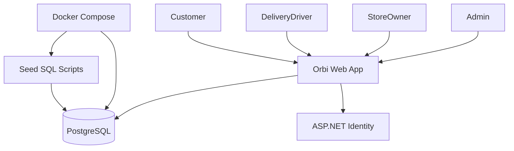
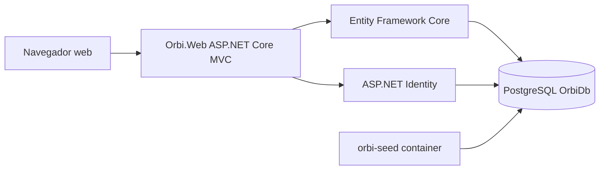
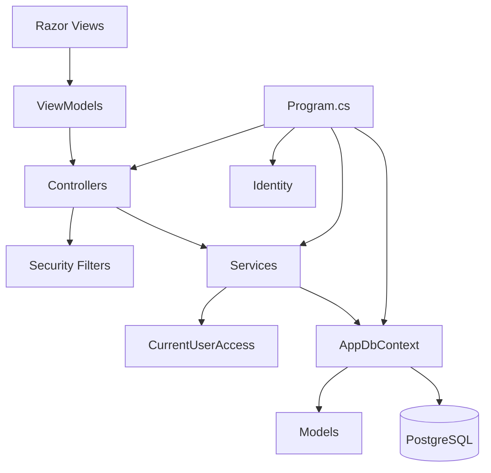
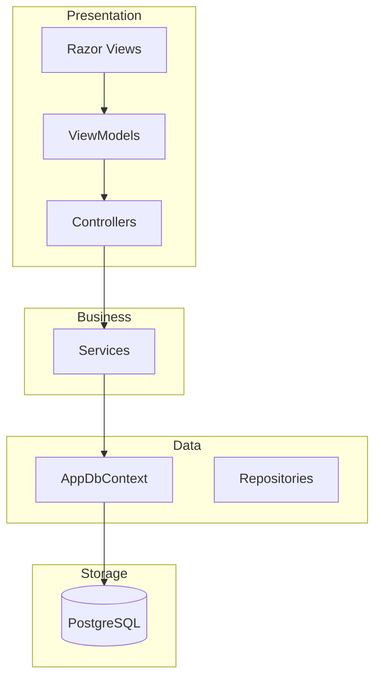
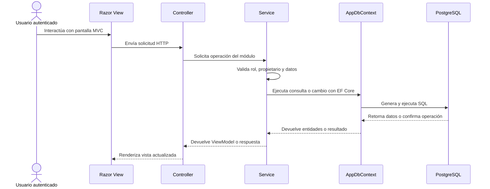
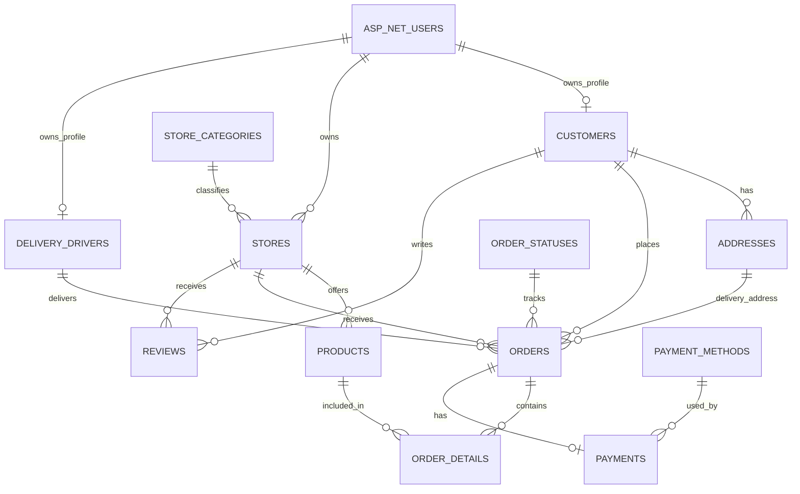
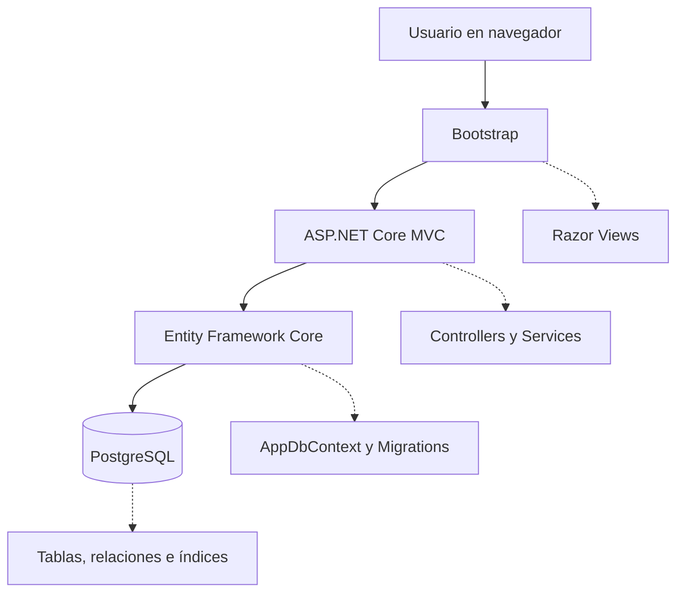

# Arquitectura

## Metodología de documentación

Este documento usa la metodología **C4 Model** para describir la arquitectura del sistema. C4 organiza la documentación en niveles: **Contexto**, para explicar quién usa el sistema y con qué servicios interactúa; **Contenedores**, para mostrar las aplicaciones y bases de datos que lo componen; **Componentes**, para detallar las partes internas del proyecto; y **Código/Datos**, para documentar entidades, tablas, campos y relaciones. En Orbi se complementa C4 con un diagrama entidad-relación porque el sistema depende fuertemente de PostgreSQL y de las relaciones configuradas con Entity Framework Core.

## Alcance del sistema

Orbi es una aplicación web de delivery desarrollada con ASP.NET Core MVC, Entity Framework Core, ASP.NET Identity y PostgreSQL. El sistema administra tiendas, categorías, productos, clientes, direcciones, pedidos, detalles de pedido, repartidores, métodos de pago, pagos y reseñas. El acceso se divide en los roles `Admin`, `StoreOwner`, `DeliveryDriver` y `Customer`, aplicando permisos por rol, validaciones de propiedad de datos y eliminación lógica mediante `IsActive`.

## C4 - Nivel 1: Contexto

| Elemento | Descripción |
| --- | --- |
| `Admin` | Usuario con acceso completo a catálogos, directorios, tiendas, productos, pedidos, pagos y reseñas. |
| `StoreOwner` | Usuario dueño de tienda que administra sus tiendas, productos y pedidos relacionados. |
| `DeliveryDriver` | Usuario repartidor que consulta pedidos asignados y actualiza su estado o perfil. |
| `Customer` | Usuario cliente que consulta tiendas y productos, registra pedidos y revisa su información propia. |
| `Orbi Web App` | Aplicación ASP.NET Core MVC que concentra interfaz, controladores, servicios, seguridad y acceso a datos. |
| `PostgreSQL` | Base de datos relacional donde se guardan entidades de negocio e información de Identity. |
| `Docker Compose` | Define el entorno local de PostgreSQL y ejecuta scripts de carga inicial. |

## C4 - Nivel 2: Contenedores

| Contenedor | Tecnología | Responsabilidad |
| --- | --- | --- |
| `Browser` | Navegador web | Consume las vistas Razor y envía solicitudes HTTP al sistema. |
| `Orbi.Web` | ASP.NET Core MVC `net10.0` | Ejecuta controladores, vistas, servicios, filtros de seguridad, autenticación y rutas MVC. |
| `Entity Framework Core` | EF Core con Npgsql | Traduce consultas LINQ a SQL, ejecuta migraciones y gestiona relaciones con PostgreSQL. |
| `ASP.NET Identity` | Identity EF Core | Administra usuarios, roles, contraseñas, cookies y bloqueo por intentos fallidos. |
| `PostgreSQL OrbiDb` | `postgres:16-alpine` | Persiste tablas de negocio, tablas `AspNet*`, índices, relaciones y datos semilla. |
| `orbi-seed container` | PostgreSQL client image | Ejecuta scripts SQL de carga y validación después de que el esquema EF Core exista. |

## C4 - Nivel 3: Componentes internos

| Componente | Responsabilidad |
| --- | --- |
| `Views` | Presentan formularios, listados, detalles y navegación según el rol autenticado. |
| `ViewModels` | Transportan datos específicos para vistas sin exponer toda la entidad de base de datos. |
| `Controllers` | Reciben solicitudes HTTP, validan acciones MVC y coordinan respuestas. |
| `Services` | Centralizan lógica de negocio, paginación, búsquedas, reglas por propietario y validaciones antes de guardar. |
| `Security Filters` | Aplican acceso por rol y manejan respuestas `403` para rutas prohibidas. |
| `CurrentUserAccess` | Obtiene datos del usuario actual y permite filtrar registros según rol y propiedad. |
| `AppDbContext` | Define tablas, relaciones, índices, filtros globales y conexión con PostgreSQL. |
| `Models` | Representan entidades persistentes del dominio de delivery. |
| `Program.cs` | Configura servicios, middleware, Identity, seguridad, migraciones, seed y rutas. |

## Capas del proyecto

## Flujo principal de ejecución

## Relación entidad-relación

## Atributos de calidad

| Atributo | Implementación en Orbi |
| --- | --- |
| Escalabilidad de consultas | Las listas usan `IQueryable`, `Skip` y `Take` para filtrar, ordenar y paginar desde PostgreSQL sin cargar tablas completas en memoria. |
| Rendimiento de lectura | Las pantallas de consulta usan `AsNoTracking()` cuando no necesitan modificar entidades, reduciendo el costo de seguimiento de Entity Framework Core. |
| Integridad de datos | `AppDbContext` configura llaves foráneas, relaciones uno a muchos y uno a uno, restricciones de borrado e índices únicos en campos como correos y nombres de catálogos. |
| Seguridad de acceso | ASP.NET Identity, `RoleAccessFilter`, `CurrentUserAccess` y los servicios limitan rutas y registros según rol y propietario. |
| Eliminación lógica | Los registros de negocio usan `IsActive` y filtros globales para ocultar datos eliminados sin borrar físicamente la información. |
| Optimización de búsqueda | El modelo incluye índices compuestos para nombres, correos, fechas de pedido, estados, tiendas, clientes y repartidores asignados. |
| Seguridad web | `Program.cs` configura cookies `HttpOnly`, `SameSite=Strict`, antiforgery en formularios, CSP, `X-Frame-Options` y `X-Content-Type-Options`. |
| Despliegue local reproducible | `docker-compose.yml` levanta PostgreSQL 16, aplica límites de CPU/memoria y ejecuta scripts SQL de semilla y validación. |

## Detalles

### Explicación de componentes

| Componente | Explicación |
| --- | --- |
| `Models` | Contiene las clases que representan las entidades principales del dominio de Orbi, como clientes, tiendas, productos, pedidos, pagos, reseñas, repartidores y catálogos. También incluye `BaseEntity`, que centraliza campos comunes como `Id`, `IsActive`, `CreatedAt` y `UpdatedAt` para aplicar eliminación lógica y auditoría básica. |
| `Data` | Define el acceso a datos mediante `AppDbContext`, que hereda de `IdentityDbContext<ApplicationUser>` para integrar las tablas del negocio con ASP.NET Identity. En esta capa se configuran `DbSet`, relaciones, índices, filtros globales por `IsActive`, extensión `pg_trgm` y actualización automática de fechas al guardar cambios. |
| `Controllers` | Recibe las solicitudes HTTP y coordina las acciones de cada módulo MVC. Los controladores gestionan rutas para listar, ver detalles, crear, editar y eliminar registros, además de delegar la lógica de acceso y consulta a los servicios correspondientes. |
| `Views` | Contiene las pantallas Razor que muestran formularios, tablas, detalles, navegación y mensajes al usuario. Las vistas consumen `ViewModels` para presentar información filtrada según el rol autenticado y el módulo al que se accede. |
| `Services` | Encapsula la lógica de negocio y las consultas sensibles del sistema. Esta capa aplica filtros por propietario, paginación, búsquedas con `IQueryable`, validaciones antes de escribir datos y restricciones específicas para `Admin`, `StoreOwner`, `DeliveryDriver` y `Customer`. |
| `ViewModels` | Define objetos diseñados para transportar datos entre controladores y vistas sin exponer directamente las entidades completas. Incluye modelos para formularios de login, registro, perfil, paginación, dashboard y operaciones de cada módulo del sistema. |
| `Migrations` | Registra los cambios estructurales de la base de datos generados por Entity Framework Core. Incluye la creación inicial del esquema, optimizaciones para consultas con grandes volúmenes de datos, índices de búsqueda y campos adicionales para usuarios de la aplicación. |
| `Program.cs` | Configura el arranque de la aplicación ASP.NET Core: MVC, filtros globales de autorización, conexión PostgreSQL, Identity, cookies, servicios del dominio, cabeceras de seguridad, rutas, migraciones automáticas y carga inicial mediante `DbSeeder`. |
| `appsettings.json` | Guarda la configuración base de la aplicación, incluyendo niveles de logging, hosts permitidos y la cadena de conexión `DefaultConnection` hacia PostgreSQL en `localhost:5432` con la base `OrbiDb`. |

### Modelo de datos

| Modelo | Descripción | Relaciones principales |
| --- | --- | --- |
| `ApplicationUser` | Usuario de autenticación administrado por ASP.NET Identity. Permite asociar credenciales y roles con perfiles de cliente, dueño de tienda o repartidor. | Se vincula con `Customer`, `Store` y `DeliveryDriver` mediante `UserId`. |
| `Customer` | Representa al cliente que compra en la plataforma. Guarda nombres, correo único, teléfono, estado activo y datos de auditoría. | Tiene muchas `Addresses`, muchas `Orders` y muchas `Reviews`; se asocia a un `ApplicationUser`. |
| `Address` | Almacena direcciones de entrega del cliente, incluyendo calle, ciudad, estado, código postal, país y coordenadas. | Pertenece a un `Customer` y puede ser usada por una `Order`. |
| `StoreCategory` | Catálogo de categorías para clasificar tiendas, por ejemplo restaurantes, farmacias o supermercados. | Tiene muchas `Stores`; su nombre es único. |
| `Store` | Representa el negocio que vende productos dentro de Orbi. Registra categoría, propietario, contacto, dirección, coordenadas y estado activo. | Pertenece a `StoreCategory` y a un `ApplicationUser`; tiene muchos `Products`, `Orders` y `Reviews`. |
| `Product` | Producto ofrecido por una tienda. Incluye nombre, descripción, precio, stock, imagen y estado activo. | Pertenece a una `Store` y aparece en muchos `OrderDetails`. |
| `Order` | Pedido realizado por un cliente a una tienda. Guarda cliente, tienda, dirección, estado, repartidor, total, fecha de pedido y fecha de entrega. | Pertenece a `Customer`, `Store`, `OrderStatus`, `Address` y opcionalmente a `DeliveryDriver`; tiene muchos `OrderDetails` y un `Payment`. |
| `OrderDetail` | Detalle de los productos incluidos en un pedido. Registra producto, cantidad, precio unitario y subtotal. | Pertenece a una `Order` y a un `Product`. |
| `OrderStatus` | Catálogo de estados para controlar el avance del pedido, como pendiente, en proceso, entregado o cancelado. | Tiene muchas `Orders`; su nombre es único. |
| `DeliveryDriver` | Perfil del repartidor encargado de entregar pedidos. Guarda datos personales, correo único, ubicación actual, disponibilidad y estado activo. | Se asocia a un `ApplicationUser` y puede tener muchas `Orders` asignadas. |
| `PaymentMethod` | Catálogo de métodos de pago disponibles en la plataforma. | Tiene muchos `Payments`; su nombre es único. |
| `Payment` | Pago asociado a un pedido. Registra método de pago, monto, fecha, transacción, estado y eliminación lógica. | Pertenece a una `Order` en relación uno a uno y a un `PaymentMethod`. |
| `Review` | Reseña realizada por un cliente sobre una tienda. Guarda calificación, comentario, estado activo y fechas de auditoría. | Pertenece a un `Customer` y a una `Store`. |

### Tablas, campos y relaciones

| Tabla | Campos principales | Llave primaria | Llaves foráneas y relaciones |
| --- | --- | --- | --- |
| `AspNetUsers` | `Id`, `UserName`, `Email`, `PasswordHash`, `FirstName`, `LastName` | `Id` | Tabla base de ASP.NET Identity; se relaciona con `Customers.UserId`, `Stores.UserId` y `DeliveryDrivers.UserId`. |
| `Customers` | `Id`, `UserId`, `FirstName`, `LastName`, `Email`, `Phone`, `IsActive`, `CreatedAt`, `UpdatedAt` | `Id` | `UserId` referencia `AspNetUsers.Id`; se relaciona uno a muchos con `Addresses`, `Orders` y `Reviews`. |
| `Addresses` | `Id`, `CustomerId`, `Street`, `City`, `State`, `ZipCode`, `Country`, `Latitude`, `Longitude`, `IsActive` | `Id` | `CustomerId` referencia `Customers.Id`; una dirección puede ser usada por pedidos mediante `Orders.AddressId`. |
| `StoreCategories` | `Id`, `Name`, `Description`, `IsActive` | `Id` | No tiene FK; se relaciona uno a muchos con `Stores` mediante `Stores.CategoryId`. |
| `Stores` | `Id`, `UserId`, `CategoryId`, `Name`, `Description`, `Phone`, `Email`, `Address`, `Latitude`, `Longitude`, `IsActive` | `Id` | `UserId` referencia `AspNetUsers.Id`; `CategoryId` referencia `StoreCategories.Id`; se relaciona uno a muchos con `Products`, `Orders` y `Reviews`. |
| `Products` | `Id`, `StoreId`, `Name`, `Description`, `Price`, `Stock`, `ImageUrl`, `IsActive` | `Id` | `StoreId` referencia `Stores.Id`; se relaciona uno a muchos con `OrderDetails`. |
| `Orders` | `Id`, `CustomerId`, `StoreId`, `DeliveryDriverId`, `OrderStatusId`, `AddressId`, `TotalAmount`, `OrderDate`, `DeliveryDate`, `IsActive` | `Id` | `CustomerId` referencia `Customers.Id`; `StoreId` referencia `Stores.Id`; `DeliveryDriverId` referencia `DeliveryDrivers.Id`; `OrderStatusId` referencia `OrderStatuses.Id`; `AddressId` referencia `Addresses.Id`; se relaciona uno a muchos con `OrderDetails` y uno a uno con `Payments`. |
| `OrderDetails` | `Id`, `OrderId`, `ProductId`, `Quantity`, `UnitPrice`, `Subtotal`, `IsActive` | `Id` | `OrderId` referencia `Orders.Id`; `ProductId` referencia `Products.Id`. |
| `OrderStatuses` | `Id`, `Name`, `Description`, `IsActive` | `Id` | No tiene FK; se relaciona uno a muchos con `Orders` mediante `Orders.OrderStatusId`. |
| `DeliveryDrivers` | `Id`, `UserId`, `FirstName`, `LastName`, `Email`, `Phone`, `CurrentLatitude`, `CurrentLongitude`, `LastLocationUpdate`, `IsAvailable`, `IsActive` | `Id` | `UserId` referencia `AspNetUsers.Id`; se relaciona uno a muchos con `Orders` mediante `Orders.DeliveryDriverId`. |
| `PaymentMethods` | `Id`, `Name`, `Description`, `IsActive` | `Id` | No tiene FK; se relaciona uno a muchos con `Payments` mediante `Payments.PaymentMethodId`. |
| `Payments` | `Id`, `OrderId`, `PaymentMethodId`, `Amount`, `PaymentDate`, `TransactionId`, `Status`, `IsActive` | `Id` | `OrderId` referencia `Orders.Id` y es único para mantener relación uno a uno; `PaymentMethodId` referencia `PaymentMethods.Id`. |
| `Reviews` | `Id`, `CustomerId`, `StoreId`, `Rating`, `Comment`, `IsActive`, `CreatedAt`, `UpdatedAt` | `Id` | `CustomerId` referencia `Customers.Id`; `StoreId` referencia `Stores.Id`. |

## Tecnologías principales

| Tecnología | Función dentro de Orbi |
| --- | --- |
| ASP.NET Core MVC | Organiza la aplicación en controladores, vistas Razor, modelos, servicios y rutas web. |
| PostgreSQL | Almacena la información persistente del sistema, incluyendo usuarios, tiendas, productos, pedidos, pagos y reseñas. |
| Entity Framework Core | Conecta el código C# con PostgreSQL mediante `AppDbContext`, modelos, migraciones, consultas LINQ y relaciones. |
| Bootstrap | Proporciona estilos y componentes visuales para formularios, tablas, navegación y diseño responsive en las vistas. |
