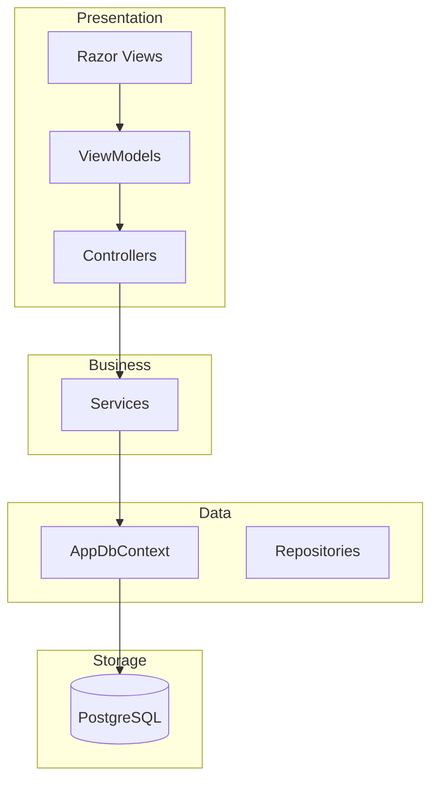

# Architecture

## Project Layers



## Entity Relationship

```mermaid
erDiagram
    Customer ||--o{ Address : has
    Customer ||--o{ Order : places
    Customer ||--o{ Review : writes
    StoreCategory ||--o{ Store : categorizes
    Store ||--o{ Product : offers
    Store ||--o{ Order : receives
    Store ||--o{ Review : rated_by
    Order ||--o{ OrderDetail : contains
    Product ||--o{ OrderDetail : listed_in
    OrderStatus ||--o{ Order : tracks
    DeliveryDriver ||--o{ Order : delivers
    PaymentMethod ||--o{ Payment : used_in
    Order ||--o| Payment : pays

    Customer {
        int Id PK
        string FirstName
        string LastName
        string Email UK
        string Phone
        string PasswordHash
        bool IsActive
        datetime CreatedAt
        datetime UpdatedAt
    }
    Address {
        int Id PK
        int CustomerId FK
        string Street
        string City
        string State
        string ZipCode
        string Country
        double Latitude
        double Longitude
        bool IsActive
    }
    StoreCategory {
        int Id PK
        string Name UK
        string Description
        bool IsActive
    }
    Store {
        int Id PK
        int CategoryId FK
        string Name
        string Description
        string Phone
        string Email
        string Address
        double Latitude
        double Longitude
        bool IsActive
    }
    Product {
        int Id PK
        int StoreId FK
        string Name
        string Description
        decimal Price
        int Stock
        string ImageUrl
        bool IsActive
    }
    Order {
        int Id PK
        int CustomerId FK
        int StoreId FK
        int DeliveryDriverId FK
        int OrderStatusId FK
        int AddressId FK
        decimal TotalAmount
        datetime OrderDate
        datetime DeliveryDate
        bool IsActive
    }
    OrderDetail {
        int Id PK
        int OrderId FK
        int ProductId FK
        int Quantity
        decimal UnitPrice
        decimal Subtotal
        bool IsActive
    }
    OrderStatus {
        int Id PK
        string Name UK
        string Description
        bool IsActive
    }
    DeliveryDriver {
        int Id PK
        string FirstName
        string LastName
        string Email UK
        string Phone
        double CurrentLatitude
        double CurrentLongitude
        datetime LastLocationUpdate
        bool IsAvailable
        bool IsActive
    }
    PaymentMethod {
        int Id PK
        string Name UK
        string Description
        bool IsActive
    }
    Payment {
        int Id PK
        int OrderId FK UK
        int PaymentMethodId FK
        decimal Amount
        datetime PaymentDate
        string TransactionId
        string Status
        bool IsActive
    }
    Review {
        int Id PK
        int CustomerId FK
        int StoreId FK
        int Rating
        string Comment
        bool IsActive
    }
```

## Scalability

| Concern | Implementation |
|---------|---------------|
| Pagination | Skip and Take with page and pageSize parameters |
| Filtering | IQueryable chain with server-side predicates |
| Soft Delete | IsActive flag with global query filters |
| Indexes | Composite indexes on StoreId plus Name, CustomerId plus StoreId, OrderDate |
| Eager Loading | Selective Include to prevent N plus 1 |
| Sessions | Distributed cache ready for Redis or SQL Server |
